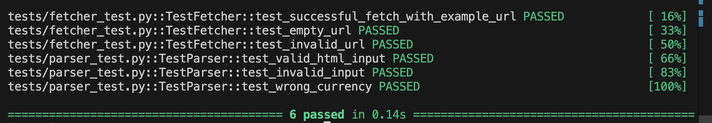
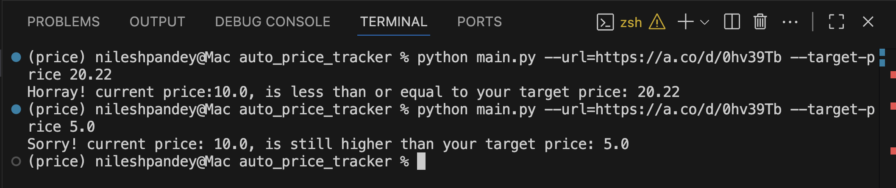

# 🔍 AutoPriceTracker

**AutoPriceTracker** is a Python CLI application that tracks prices of products from amazon.com [U.S.A. Only] and informs users whether the current price is below their target value or not.

---

## 🚀 Features

- ✅ Track product prices from a given amazon.com URL and inform the user whether the current price ($ only) is below their targer price or not
- ✅ Testable components using Pytest
- ✅ Automated CI testing pipeline with GitHub Actions for every push and pull request

---

## 🛠️ Stack

- Python 3.11+
- `requests`, `regex` for web scraping
- `pytest` for testing
- GitHub Actions for CI/CD
- `ruff` for fast linting & formatting
- `pre-commit` git hook for ruff to automate linting and formatting before commit

---

## 📦 Installation

```bash
git clone https://github.com/nileshpandey3/auto_price_tracker
cd into the project root dir
python -m venv venv
source venv/bin/activate 
pip install -r requirements.txt
```

---

## 🧪 Running Tests

```bash
pytest
```

---

## 📈 Example Usage

```bash
python main.py --url https://www.amazon.com/dp/B08N5WRWNW --target-price 200
```




---
